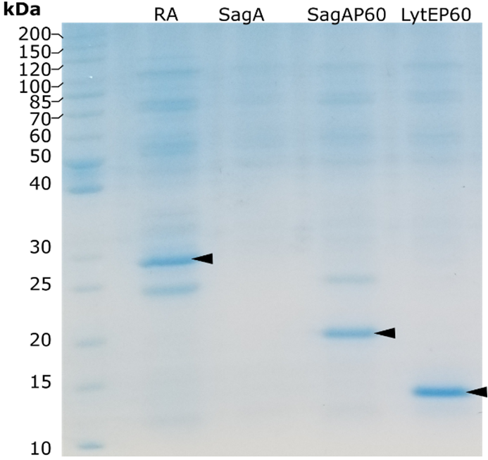
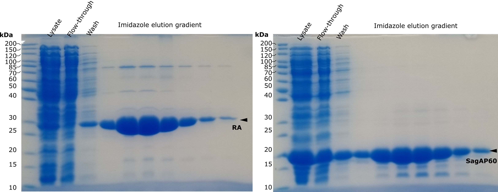

# **Results**

## Cloning and purification

Genes were cloned in pKTCTET-0-Kan vector containing a C-terminal 6His-tag (Obexer et al., 2016). Retro-aldolase 95.2B-3 (RA) was cloned in the same vector as control. Sanger sequencing relvealed that LytE gene underwent a frame-shift mutation, therefore the construct was not used. Genes were expressed in *Escherichia coli*. And purified over a Ni-NTA column. RA, SagAP60 and LytEP60 were purified with acceptable yield, while full length SagA was not recovered in the eluate(Fig 1). Larger amounts of RA and SagAP60 proteins were purified using ÄKTA Avant chromatography system in a second stage (Fig 2).

{ width=300px }

Figure 1. SDS-PAGE analysis of proteins purified using spin-columns. Target proteins are denoted by black arrowheads.

{ width=1000px }
Figure 2. SDS-PAGE analysis of  of proteins purified using chromatographer. Target proteins are denoted by black arrowheads. Purification was performed after submitting the report.

## Microtiter plate assay

Purified enzyme fractions have been used to test activity in microtiter plate assay. This proof-of-concept experiment shows that an NlpC/P60 domain can cut synthetic peptide generating fluorescent signal over background. Since starting protein activity is low (after a few hours reaction continues) it is a good starting point to test proposed directed evolution method.

{ width=1000px }
Figure 3. Microtiter plate assay. Blue – buffer, cyan – Retro-aldolase, green – SagAP60.

## Endopeptidase assay in droplets

Following the test in microtiter plate, an experiment to verify functionality of the enzyme assay in droplets was performed: a solution of assay buffer containing the enzyme (Fig 4A) and a control solution of assay buffer without the enzyme (Fig 4B) were encapsulated and the emulsion was imaged after overnight incubation at 37°C. 
To verify the long-term retention of the fluorescent signal in the positive droplets, 10 µL aliquots from both emulsions were mixed and imaged after incubation at 37°C for 2 days (Fig 4C). No appreciable fluorescence exchange between positive and negative droplets was detected.

{ width=1000px }
Figure 4. Assay in droplet. A – positive sample after encapsulation (time 0); B – positive emulsion containing the enzyme (top) next to control emulsion (bottom); C – mixed emulsion of positive and control sample: no leakage is observed after 2 days incubation.

## Live assay on cell suspension

Purified SagAP60 and RA control were used on a suspension of *S. aureus* to test the starting antimicrobial activity. The test was carried out as cell growth assay, by observing the increase of OD600 of cells suspended in LB medium (Fig 5).

{ width=1000px } 
Figure 5. *S. aureus* growth inhibition assay. Blue – background (buffer); Cyan – RA control; Green - SagAP60; Yellow – cell negative control, without any enzyme added.

From the results it appears that the added proteins have a positive effect on growth compared to negative control: we believe this is due to the fact that they were added to the assay as glycerol stocks, providing an additional carbon source we haven’t accounted for, with a 4% glycerol final concentration in the well. For this reason, this test will be repeated using dialysed protein sample.

The assay was repeated with re-purified proteins after the submission of the report (Figure 6). Even though the addition of SagAP60 impacted cell growth negatively (compared to negative control and RA), the difference may be insignificant. It also appears that RA impacts cell growth positively in some unknown mechanism. It is unclear why this is observed. At this point, it is clear that for evaluating lytic activity on live cells an active site mutant control will be needed. Also, it is apparent, that SagAP60 does not lyse S. aureus cell wall efficiently. This is probably explained by the low activity of enzymes which may be increased by directed evolution.

{ width=1000px }
Figure 6. *S. aureus* growth inhibition assay. Blue – background (buffer); Cyan – RA control; Green - SagAP60; Yellow – cell negative control, without any enzyme added.

## Discussion

These preliminary proof-of-concept experiments confirm the effectiveness of our directed evolution strategy. We verified that the C-terminal NlpC/P60 domain of SagA can digest the FRET D-L-peptide-based molecular beacon and that the absence of the N-terminal domain is not necessary for the protein to display activity. Enzyme activity under the tested conditions is sufficient to generate a fluorescent signal detectable above background in both in microtiter plate and droplet assays. Commonly, the fluorophores present in commercially available fluorogenic substrate are exchanged between the fluorescent positive droplets – where the reactions occurred – and the negative ones, posing a relevant technical issue for the sorting step; the cleavage of the peptide beacon releases the fluorophore covalently bonded to 3 amino acids residues, greatly increasing its solubility and favouring the long-term retention in the droplet. This was confirmed by the fluorophore exchange assay. We also carried a preliminary experiment to assess the effect of the native SagA Nlpc/P60 domain as *S. aureus* antimicrobial agent; however, this first results don’t allow to draw any significant conclusion. Further experiments will be necessary to determine the antimicrobial activity of the starting endolysins by titration using different purified enzyme concentration.
Overall, we believe that this project represents an interesting proof of concept for the development of new antimicrobial agents based on the currently underused NlpC/P60 peptidase protein family and for the development of enzymes targeting peptides harbouring non-canonical amino acids.
