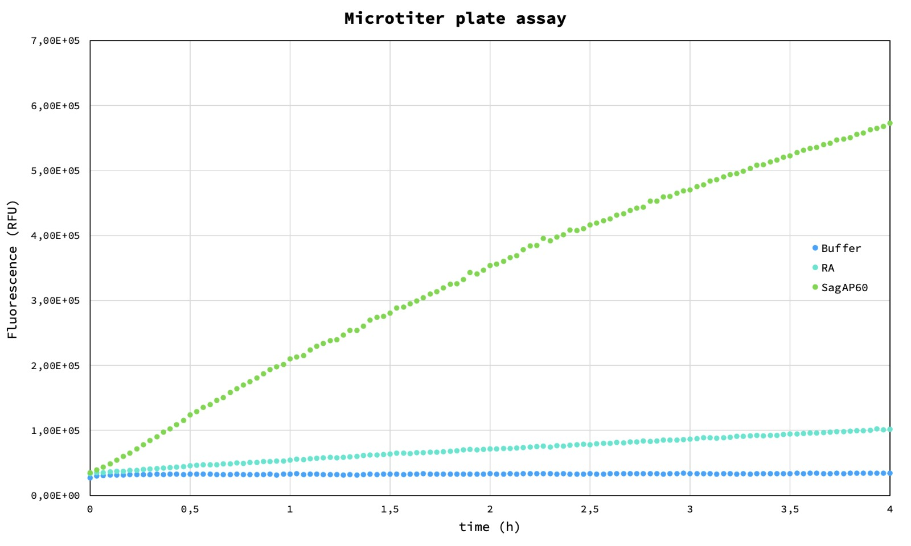

# **Results**

## Cloning and purification

Genes were cloned in pKTCTET-0-Kan vector containing a C-terminal 6His-tag (Obexer et al., 2016). Retro-aldolase (RA) was cloned in the same vector was selected as control. Sanger sequencing relvealed that LytE gene underwent a frame-shift mutation, and construct was not used. Genes were expressed in *Escherichia coli*. Sufficient amounts of RA, SagAP60 and LytEP60 were purified, but not full length SagA.

{ width=500px }

Figure 1. SDS-PAGE analysis of purified proteins of interest. Target proteins are denoted by black arrowheads.

## Microtiter plate assay

Purified enzyme fractions have been used to test activity in microtiter plate assay. This proof-of-concept experiment shows that an NlpC/P60 domain can cut synthetic peptide generating fluorescent signal over background. Since starting protein activity is low (after a few hours reaction continues) it is a good starting point to test proposed directed evolution method.

{ width=1000px }

## Endopeptidase assay in droplets

Following the test in microtiter plate, a solution of assay buffer containing the enzyme (Fig 3A) and a control solution of assay buffer without the enzyme (Fig 3B) were encapsulated to verify the functionality of the enzyme assay in droplets and imaged after overnight incubation at 37°C. 
To verify the long-term retention of the fluorescent signal in the positive droplets, 10 µL aliquots from both emulsions were mixed and imaged after incubation at 37°C for 2 days (Fig 3C). No appreciable fluorescein exchange between positive and negative droplets was detected.

{ width=1000px }

## Live assay on cell suspension
