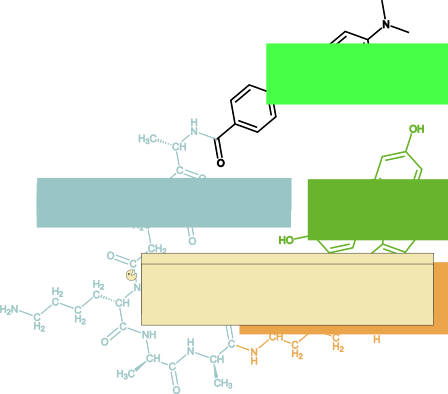
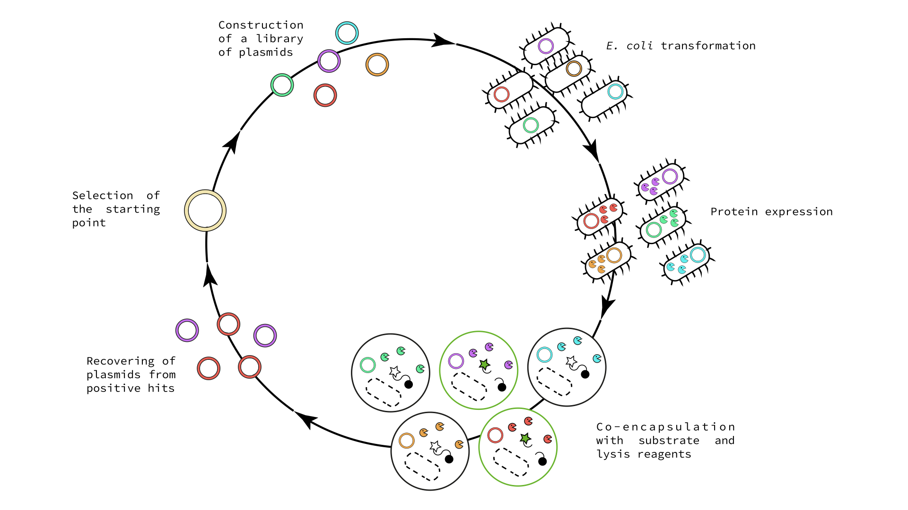

# **Strategy**

## *In-drop* evolution

The aim of our project is to evolve this protein as an effective bacteria-killing agent with the aid of a droplet microfluidics (DµF) platform; this technology allows the generation of large numbers of droplets that each act as single compartments, allowing the screening of large mutant libraries with high frequencies, resulting in a considerable reduction of the time, reaction volumes and the exploration of a larger fraction of the sequence space. This technology has already been successfully applied to evolve enzyme from several classes (Stucki et al., 2021). 

Figure 1. Microfuidics set up.

## The assay

To this purpose, we developed a microfluidics assay based on a FRET peptide-based molecular beacon mimicking the PG linking peptide of the well-known pathogen *Staphylococcus aureus*. If such peptide is cut by the enzyme the fluorophore and quencher parts of the molecule are separated and fluorophore is no no longer quenhed - thus fluorescent signal increases.

{ width=400px }
Figure 2. FRET peptide-based molecular beacon will create fluorescent sginal after cleavage of peptidic bond. The peptidase is denoted as "Pacman", aminoacids in the peptide as blue cicles, fluorophore as star, and quecher as a black .

Since SagA was reported to cleave PG fragments with tetra- and penta-peptides, we selected the pentapeptide as the substrate (Ala-D-isoGln-Lys-D-Ala-D-Ala). For technical reasons related to the laser system available in the droplet microfluidic station setup, the fluorophore-quencher pair FAM-Dabcyl was chosen. The synthesis of the final beacon peptide required the addition of and Lysine for attaching FAM at C-terminal; therefore, the final sequence of the peptide is (Dabcyl)-Ala-D-isoGln-Lys-D-Ala-D-Ala-Lys-(5-FAM). 

{ width=500px }

The mutant library will be created by error-prone PCR, expressed using *E. coli* based expression system and encapsulated with substrate peptide in droplets. Single cells with carying enzyme mutants will be lysed and the ability to cleave synthetic fluorogenic peptides will be evaluated. Mutants will be screened by sorting the droplets. Plasmids from droplets with increased fluorescent signal will be retrieved and sequenced and/or subjected to other directed evolution cycle.

{ width=1200px }

## Validation

Starting protein and final product of evolution will be then used to perform *in vivo* assays to assess the activity of impairing *Staphylococcus aureus* growth in solution.

